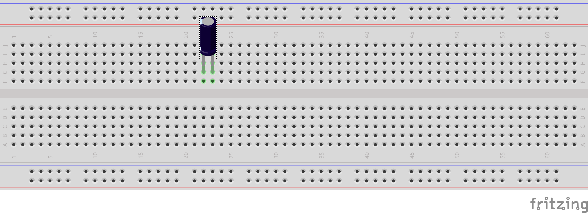

# 🔹 Braille Writing Tutor

<div align="center">


*An innovative educational tool designed to help users learn Braille writing through interactive technology*

[Features](#-features) •
[Hardware](#-hardware-components) •
[Installation](#-installation) •
[Usage](#-usage) •
[Contributing](#-contributing)

</div>

---

## 📋 Table of Contents

- [Overview](#-overview)
- [Features](#-features)
- [Hardware Components](#-hardware-components)
- [Software Architecture](#-software-architecture)
- [Project Structure](#-project-structure)
- [Installation](#-installation)
- [Usage](#-usage)
- [Circuit Diagram](#-circuit-diagram)
- [Development](#-development)
- [Contributing](#-contributing)
- [License](#-license)
- [Author](#-author)

## 🎯 Overview

The **Braille Writing Tutor** is an assistive technology project that combines hardware and software to create an interactive learning environment for Braille writing. This system uses Arduino microcontrollers and Raspberry Pi to provide tactile feedback and real-time guidance for users learning to write in Braille.

### 🎨 Key Objectives

- **Educational**: Provide an interactive way to learn Braille writing
- **Accessible**: Make Braille education more engaging and effective
- **Affordable**: Use common, cost-effective hardware components
- **Extensible**: Modular design for easy customization and expansion

## ✨ Features

### 🔧 Hardware Features
- **Tactile Feedback System**: Physical Braille cell simulation
- **Arduino-based Control**: Precise motor and sensor control
- **Raspberry Pi Integration**: Advanced processing and connectivity
- **Modular Design**: Easy to assemble and modify
- **Rotary Knob for Tutoring Phases**: OFF + six staged training modes
- **Mechanical Braille Display**: SMA-coil-driven embossed pins for mirrored display

### 💻 Software Features
- **Interactive Learning Modules**: Step-by-step Braille writing tutorials
- **Real-time Feedback**: Immediate correction and guidance
- **Progress Tracking**: Monitor learning advancement
- **Customizable Lessons**: Adaptable difficulty levels

### 🌐 System Features
- **Cross-platform Compatibility**: Works on multiple operating systems
- **Extensible Architecture**: Easy to add new features
- **Open Source**: Community-driven development
- **Localized Prompts**: Filipino/English auditory feedback for clarity

## 🛠 Hardware Components

### Required Components
- **Arduino Uno/Nano**: Main controller for Braille display
- **Arduino Mega 2560**: Writing slate controller (100-button matrix)
- **Raspberry Pi 4**: Central processing unit and user interface
- **SMA Coils/Magnetic Actuators**: 60 units (10 cells × 6 dots) with bidirectional control
- **74HC595 Shift Registers**: 15 units for controlling 120 outputs (60 dots × 2 directions each)
- **Tactile Buttons**: 100 mini buttons for 10×10 writing slate matrix
- **Tactile Buttons**: 4 control buttons (register, erase, read, display) on RPi
- **Rotary Knob/Switch**: Phase selection (OFF + 6 positions)
- **Power Supply**: 5V/12V for actuators and logic
- **Connecting Wires**: For matrix, shift registers, and inter-Arduino communication

### Optional Components
- **LCD Display**: Visual feedback (for instructors)
- **Speaker**: Audio feedback system
- **LED Indicators**: Status and progress indicators
- **Rotary Knob / Multi-position Switch**: Select OFF and phases 1–6
- **SMA Coils / Solenoids**: For the mechanical Braille display

### GPIO Button Map (Raspberry Pi — BCM numbering)

The Raspberry Pi application uses four tactile buttons. Pins are defined in `source/rpi/BrailleWritingTutor/pins_config.py` and use internal pull‑ups (pressed = LOW):

| Button    | GPIO (BCM) |
|-----------|------------|
| register  | 18         |
| erase     | 19         |
| read      | 20         |
| display   | 21         |

Notes:
- Inputs are configured with `GPIO.PUD_UP`, and interrupts fire on FALLING edges.
- A software debounce of 200 ms is applied per button.

## 🏗 Software Architecture

```
Braille Writing Tutor System
├── Raspberry Pi (Python) - Main Controller
│   ├── User Interface & TTS
│   ├── Learning Engine & Phases
│   ├── Button Management (GPIO)
│   ├── Knob Phase Selection
│   └── Serial Communication
│
├── Arduino Uno - Braille Display Controller
│   ├── 10-cell Braille Display (60 SMA/magnetic actuators)
│   ├── Bidirectional Control (UP/DOWN per dot = 120 outputs)
│   ├── 74HC595 Shift Registers (15 units for 120 outputs)
│   ├── Serial Communication (USB to RPi)
│   ├── Phase-based Display Logic
│   └── BRAILLE_CONFIG.cpp/.h
│
└── Arduino Mega - Writing Slate Controller
    ├── 10x10 Tactile Button Matrix (100 buttons)
    ├── Matrix Scanning & Debouncing
    ├── Position LEDs (optional)
    ├── Serial Communication to Main Arduino
    └── Button-to-Braille Mapping
```

### Communication Flow
1. **RPi ↔ Arduino Uno**: USB Serial (115200 baud)
   - Commands: `PHASE:n`, `DISPLAY:text`, `MIRROR:text`, `CLEAR`, `TEST`
   - Responses: `READY`, `PHASE_SET:n`, `DISPLAYED:text`, `BUTTON_PRESS:row,col,cell,dot`

2. **Arduino Uno ↔ Arduino Mega**: SoftwareSerial pins 7,8 (115200 baud)
   - From Mega: `BTN:row,col`, `REL:row,col`
   - To Mega: `LED:row,col,state`, `TEST`, `STATUS`

3. **Hardware Control**:
   - **Braille Display**: 60 SMA coils/magnetic actuators via shift registers
   - **Writing Slate**: 10x10 button matrix with row/column scanning
   - **GPIO Buttons**: 4 tactile buttons on RPi (register, erase, read, display)
   - **Phase Knob**: Rotary switch/encoder on RPi GPIO

### Raspberry Pi application components

- `main.py`
  - Starts the system, installs signal handlers (SIGINT/SIGTERM) for graceful shutdown, and plays a welcome/shutdown TTS.
  - Delegates all button handling to `ButtonManager` and keeps a lightweight main loop alive.

- `button_config.py`
  - `ButtonManager` configures GPIO in BCM mode and registers per‑button edge interrupts.
  - Thread‑safe debouncing via a per‑button timestamp and a `threading.Lock`.
  - Executes callbacks on dedicated daemon threads to prevent ISR blocking.
  - Provided callbacks: `on_register_button`, `on_erase_button`, `on_read_button`, `on_display_button`.

- `gtts_config.py`
  - `TTSManager` uses gTTS to synthesize speech to a temporary MP3 and plays it via `pygame.mixer`.
  - Non‑blocking and blocking playback modes; safe console fallback if audio is unavailable.
  - `BrailleTTS` supplies domain‑specific prompts (welcome, registered, erased, reading/displaying pattern, errors, shutdown).

- `pins_config.py`
  - Central definition of GPIO pin assignments (`BUTTON_PINS`).

- `test_tts.py`
  - Standalone script to validate TTS/audio without requiring GPIO hardware.

## 📁 Project Structure

```
BRAILLE WRITING TUTOR/
├── 📄 README.md                    # Project documentation
├── 📁 source/                      # Source code directory
│   ├── 📁 arduino/                 # Arduino firmware
│   │   ├── 📁 BrailleWritingTutor/ # Main Arduino controller (Uno)
│   │   │   ├── 📄 BrailleWritingTutor.ino  # Main controller code
│   │   │   ├── 📄 BRAILLE_CONFIG.h         # Braille display header
│   │   │   └── 📄 BRAILLE_CONFIG.cpp       # Braille display implementation
│   │   └── 📁 BrailleWritingSlate/ # Writing slate controller (Mega)
│   │       └── 📄 BrailleWritingSlate.ino  # 10x10 button matrix handler
│   └── 📁 rpi/                     # Raspberry Pi software
│       └── 📁 BrailleWritingTutor/ # Main Python application
│           ├── 📄 main.py
│           ├── 📄 button_config.py     # GPIO + button ISR/threads
│           ├── 📄 pins_config.py       # Centralized pin mapping (BCM)
│           ├── 📄 gtts_config.py       # gTTS + pygame TTS manager
│           ├── 📄 test_tts.py          # TTS quick test (no GPIO)
│           ├── 📄 requirements.txt     # Python package pins
│           └── 📄 README.md            # Module-level notes (if any)
├── 📁 diagram/                     # Circuit diagrams and schematics
│   ├── 📄 Wiring.fzz              # Fritzing circuit file
│   └── 🖼 Wiring_bb.png           # Breadboard wiring diagram
└── 📁 model/                       # 3D models and mechanical designs
```

## 🚀 Installation

### Prerequisites

#### For Arduino Development
- Arduino IDE 1.8+ or Arduino CLI
- USB cable (Type-A to Type-B)
- Required Arduino libraries (listed in code)

#### For Raspberry Pi Development
```bash
# System requirements
- Raspberry Pi OS (Bullseye or newer)
- Python 3.8+
- Audio output device (headphones, HDMI/USB sound) for TTS
- GPIO access permissions
```

### Step-by-Step Setup

#### 1. Clone the Repository
```bash
git clone https://github.com/qppd/Braille-Writing-Tutor.git
cd Braille-Writing-Tutor
```

#### 2. Arduino Setup
```bash
# Navigate to Arduino source
cd source/arduino/BrailleWritingTutor

# Open in Arduino IDE or compile with CLI
arduino-cli compile --fqbn arduino:avr:uno BrailleWritingTutor.ino

# Upload to Arduino
# For Linux/RPi: replace with your serial device (e.g., /dev/ttyUSB0 or /dev/ttyACM0)
arduino-cli upload -p /dev/ttyUSB0 --fqbn arduino:avr:uno
# For Windows: use the correct COM port (e.g., COM3)
arduino-cli upload -p COM3 --fqbn arduino:avr:uno
```

#### 3. Raspberry Pi Setup
```bash
# Navigate to Python source
cd source/rpi/BrailleWritingTutor

# Update system and install system packages for audio/GPIO
sudo apt update && sudo apt upgrade -y
sudo apt install -y python3-pip python3-venv python3-dev \
    python3-rpi.gpio espeak espeak-data alsa-utils

# Optional: ensure your user can access GPIO without sudo (log out/in after)
sudo usermod -a -G gpio $USER

# Create and activate a virtual environment (recommended)
python3 -m venv .venv
source .venv/bin/activate

# Install Python dependencies
pip install --upgrade pip
pip install -r requirements.txt

# Verify audio output (set the right device if using HDMI)
alsamixer   # adjust volumes; press Esc to exit

# Quick TTS check (no GPIO required)
python3 test_tts.py

# Run the full application (requires wired buttons on listed GPIOs)
python3 main.py
```

Tips:
- If audio fails to initialize, `TTSManager` falls back to printing text. Ensure a valid audio device and that `pygame.mixer` can open it.
- On headless systems, prefer the headphone jack or a USB sound card; select device via `raspi-config` or `pavucontrol`.

#### 4. Hardware Assembly
1. Follow the circuit diagram in `diagram/Wiring_bb.png`
2. Connect Arduino to Raspberry Pi via USB
3. Wire sensors and actuators as shown in the schematic
4. Ensure proper power supply connections

## 🎮 Usage

### Basic Operation

1. **Power On**: Connect power to both Arduino and Raspberry Pi
2. **Initialize**: Run the Python application on Raspberry Pi
3. **Calibrate**: Follow on-screen calibration instructions
4. **Learn**: Start with basic Braille character tutorials
5. **Practice**: Use guided writing exercises
6. **Progress**: Track learning advancement

### Learning Modes

- **Tutorial Mode**: Step-by-step character learning
- **Practice Mode**: Free-form writing practice  
- **Test Mode**: Assessment and evaluation
- **Custom Mode**: User-defined lessons

### Four Buttons (behavior)

These tactile buttons are wired per the GPIO map and handled asynchronously:

- Register Button — Para sa pag‑input nung sinulat/tinusok ng bata sa E‑slate. Registers the current dots/letter/word based on the active phase.
- Erase Button — Para ma‑erase yung in‑input/ni‑register ng bata. Clears the current entry or last unit (dot/letter/word) per phase rules.
- Read Button — Sasalitain yung word/character na na‑register. Speaks back the stored unit using TTS.
- Display Button — Idi‑display ng Mechanical Display (SMA coils) yung equivalent na letter/s o words. Raises the mirrored pins for tactile reading.

Implementation notes:
- Buttons trigger GPIO interrupts and fire thread‑safe callbacks with 200 ms debounce.
- TTS provides immediate auditory feedback (Filipino/English).

### Braille letters: Writing POV vs Reading POV (mirroring)

- For "Reading," the embossed pins are felt in the standard orientation (dot numbering within a six‑dot cell).
- For "Writing," the learner pokes the mirror equivalent on the slate so that, when the page is turned for reading, the intended dots are raised.
- The mechanical display reflects this by showing the mirrored equivalent via embossed pins.
- Capitalization, numbers, and punctuation follow standard Braille rules (e.g., capital sign dot 6; number sign dots 3‑4‑5‑6). See DEPED curriculum link below.

Curriculum reference (DEPED):
- Instruction Manual: https://archive.org/details/instructionmanua00depa/page/n22/mode/1up?view=theater

### Braille quick reference (cheat sheet)

Dot numbering within a 6‑dot cell (Reading POV):

```
1 4
2 5
3 6
```

Capitalization and numbers:

- Capital sign: dot 6 (place before the letter)
- All caps indicator: dot 6, dot 6 (applies to subsequent letters until canceled)
- Number sign: dots 3‑4‑5‑6 (enables number mode)
- Numerals: 1–0 map to letters a–j while in number mode

Common punctuation (verify per DEPED/Philippine Braille standard):

| Symbol | Name        | Dots    |
|--------|-------------|---------|
| ,      | Comma       | 2       |
| ;      | Semicolon   | 2‑3     |
| :      | Colon       | 2‑5     |
| .      | Period      | 2‑5‑6   |
| ?      | Question    | 2‑6     |
| !      | Exclamation | 2‑3‑5   |
| '      | Apostrophe  | 3       |
| -      | Hyphen      | 3‑6     |

Letter families (English Braille rules; check local variations):

- a–j: base patterns in the top two rows (examples: a=1, b=1‑2, c=1‑4, d=1‑4‑5, e=1‑5, f=1‑2‑4, g=1‑2‑4‑5, h=1‑2‑5, i=2‑4, j=2‑4‑5)
- k–t: add dot 3 to a–j (e.g., k=1‑3, t=2‑3‑4‑5)
- u‑v‑x‑y‑z: add dot 6 to k‑o (e.g., u=1‑3‑6, z=1‑3‑5‑6); w is special: 2‑4‑5‑6

Note:
- When writing on the slate, poke the mirror equivalent so that the intended dots are raised when read. The mechanical display helps reinforce this mirroring.
- For authoritative details for the Philippine curriculum, refer to the DEPED manual linked above.

### Tutoring phases (knob‑controlled OFF + 1..6)

The system uses a physical knob to select stages. Initial state is OFF; rotating advances to each phase.

1) First Phase: Embossing Phase
   - Goal: Familiarity with six‑dot cell and dot numbering/positions.
   - Flow: When the stylus touches the slate, the system announces touched dot positions and compares against the target.
   - Register: Press "Register" to record each pressed dot/position.
   - Read: Press "Read" to hear the current/required position.
   - Error feedback: "Mali, subukan muli." then short hint "Ang tamang tuldok ay [dot number].".
   - Correct feedback: "Tama, ito ay [dot number].".
   - Display: Mechanical display shows the mirrored equivalent via embossed pins.

2) Second Phase: Character Identification Phase
   - Goal: Identify and write letters (small/capital), numbers, and punctuation.
   - Rules: Capitalization via dot 6 before letter (double dot 6 to apply to a sequence). Numbers are a–j preceded by number sign (3‑4‑5‑6). Some punctuation uses two cells.
   - Buttons: Register/Erase to input/correct the current cell; Read to speak and Display to emboss the letter/punctuation.
   - Success example: "Tama, naisulat mo ang titik C."
   - Error example: "Mali ang naisulat mo" + guidance "Tandaan ang letrang ito ay isinusulat sa tuldok na [dot combination].".

3) Third Phase: Morphology Phase (word formation)
   - Goal: Write words across multiple cells (with capitalization and numbers).
   - Flow: Letters auto‑register on each transition between cells; Register button confirms when the word is complete.
   - Read: System speaks the constructed word to support spelling and structure.
   - Success example: "Tama, naisulat mo ang salitang [word].".
   - Error example: "Mali, hindi ito ang tamang salita, ang baybay ng salitang [word] ay [correct spelling of the word].".

4) Fourth Phase: Sentence Formation Phase
   - Goal: Compose sentences; position feedback is removed (learner is presumed familiar with dot positions).
   - Flow: Register each word; after the last word, press Read to hear the full sentence(s).
   - Success example: "Naisulat mo ng tama ang pangungusap."
   - If mistakes are detected, the system will read the entire sentence and mention spacing and punctuation, e.g.:
     - "Naglalakbay [puwang] sa [puwang] malayong [puwang] lugar [puwang] ang [puwang] mga [puwang] kalalakihan [tuldok]."

5) Fifth Phase: Gamification
   - Goal: Reinforce writing via a sound‑to‑word game (animal sounds → spell the animal name).
   - Design: 10 animals, grouped from easy to difficult by name length.
   - Attempts: Up to three mistakes allowed; the sound replays after each mistake before revealing the answer.
   - Scoring: Tracks correct responses and reports a final score for motivation.

6) Sixth Phase: Free‑hand Writing
   - Goal: Free writing mode; the system reads exactly what the learner writes, regardless of spelling correctness.
   - Purpose: Simulates writing on paper with immediate auditory reading by the system.

Knob behavior and TTS prompts:
- Startup: With the knob at OFF, the system is inactive. Turning to Phase 1 auto‑activates tutoring.
- Activation audio: "Maligayang pagdating sa Phase 1: Pag‑aaral ng basic Braille dots." The system explains dot numbering and instructs poking the slate with a metal‑tipped stylus.
- Phase transitions: On each turn, the system announces "Maligayang pagdating sa Phase [N]: Pag‑aaral ng [program description]." and loads the corresponding tasks.
- Manual progression: If the user stays in a phase after completing tasks, the system can restart the session: "Binabati kita. Natapos mo na ang aralin. Magsisimula muli ang tutorial sa Phase 1. Kung gusto mong lumipat sa ibang bahagi ng aralin, mangyaring ilipat lang gamit ang knob."
- Deactivation: Turning the knob back to OFF powers down auditory and tactile outputs.
### Button actions (as implemented)

- Register (GPIO 18): records the current Braille pattern and plays a confirmation prompt.
- Erase (GPIO 19): clears the current input and announces the action.
- Read (GPIO 20): reads back the stored pattern (placeholder sample provided in code).
- Display (GPIO 21): announces that the current pattern is being displayed.

Implementation details:
- Button presses are detected via GPIO interrupts; callbacks are executed on background daemon threads.
- A 200 ms debounce prevents accidental double‑presses.

## 📊 Circuit Diagram



*Complete wiring schematic showing connections between Arduino, Raspberry Pi, sensors, and actuators. The Fritzing source file is available at `diagram/Wiring.fzz`.*

## 🔧 Technical Implementation

### System Architecture

The Braille Writing Tutor employs a modular architecture with the following core components:

#### Main Application (`main.py`)
- Comprehensive system initialization with proper dependency management
- Real-time system monitoring and status checking
- Graceful shutdown with proper resource cleanup
- Arduino reconnection logic and heartbeat monitoring
- Multi-threaded operation for responsive user interaction

#### Button Manager (`button_config.py`)
- Rotary encoder (knob) support for phase selection
- GPIO interrupt handling with advanced debouncing (200ms)
- Thread-safe button callbacks executed on daemon threads
- Error recovery and hardware failure tolerance
- Support for emergency stop functionality via knob button

#### Phase Manager (`phase_manager.py`)
- Complete implementation of all 6 tutoring phases
- Phase-specific input handling and audio feedback
- Dynamic learning progression with adaptive difficulty
- Integration with Arduino display controller
- Comprehensive lesson state management

#### Arduino Controller (`arduino_controller.py`)
- Robust serial communication with automatic port detection
- Multi-threaded communication (separate reader/writer threads)
- Message parsing and callback system for real-time events
- Connection monitoring with automatic reconnection
- Command queue for reliable message delivery

#### Pin Configuration (`pins_config.py`)
- Centralized GPIO pin assignments with conflict validation
- Support for buttons, rotary encoder, LEDs, and serial communication
- Comprehensive documentation of all hardware connections
- Pin availability checking and resource management

### Communication Protocol

#### Arduino Commands
The system sends structured commands to the Arduino controllers:

```
PHASE:n          - Set tutoring phase (0-6)
DISPLAY:text     - Show text on Braille display
MIRROR:text      - Show mirrored text for writing practice
CLEAR            - Clear the display
ENABLE/DISABLE   - Control display power state
TEST             - Run diagnostic sequence
HEARTBEAT        - Keep-alive signal
```

#### Arduino Responses
The Arduino controllers send status and event messages:

```
READY            - Arduino initialization complete
PHASE_SET:n      - Phase change confirmation
DISPLAYED:text   - Display operation complete
BUTTON_PRESS:row,col,cell,dot  - Writing slate input detected
DOT_PRESSED:cell,dot           - Direct dot input
HEARTBEAT        - System health signal
ERROR:message    - Error conditions and diagnostics
```

### Advanced Features

#### Smart Management
- **Singleton Pattern**: Ensures single instances of all managers
- **Lazy Loading**: Prevents circular import issues during initialization
- **Error Recovery**: Graceful handling of hardware disconnections
- **Status Monitoring**: Periodic system health checks every 30 seconds
- **Resource Cleanup**: Proper shutdown sequence in reverse initialization order

#### Hardware Integration
- **Dual Arduino Setup**: Uno for display control, Mega for writing slate
- **60 SMA Coils**: Bidirectional control via 15 shift registers (120 outputs)
- **10x10 Button Matrix**: Real-time scanning with debouncing
- **Audio System**: gTTS with pygame for bilingual feedback
- **GPIO Optimization**: Interrupt-driven input handling

#### Learning Analytics
- **Progress Tracking**: Per-phase completion metrics
- **Error Analysis**: Pattern recognition for common mistakes
- **Adaptive Difficulty**: Dynamic lesson adjustment based on performance
- **Session Logging**: Comprehensive activity recording

### Testing and Validation

#### Comprehensive Test Suite (`test_system.py`)
- Module import validation
- Pin configuration conflict checking
- TTS system functionality testing
- Phase manager state transitions
- Arduino communication protocol validation
- Button manager interrupt handling
- Integration testing across all components

#### Hardware Testing (`test_components.py`)
- GPIO pin connectivity verification
- Button responsiveness testing
- Arduino communication validation
- Audio output verification

#### TTS Testing (`test_tts.py`)
- Audio system initialization
- Text-to-speech functionality
- Language switching capabilities
- Error condition handling

### Performance Optimization

#### Threading Architecture
- **Main Loop**: 100ms cycle for system monitoring
- **GPIO Interrupts**: Sub-millisecond response time
- **Arduino Communication**: Non-blocking with 10ms polling
- **TTS Processing**: Background synthesis and playback

#### Memory Management
- **Lazy Loading**: Components loaded only when needed
- **Resource Pooling**: Reuse of audio and communication objects
- **Garbage Collection**: Proper cleanup of temporary resources
- **State Persistence**: Minimal memory footprint for lesson data

#### Error Handling
- **Graceful Degradation**: System continues operation with limited functionality
- **Automatic Recovery**: Reconnection attempts for failed components
- **User Feedback**: Clear audio notifications for all error conditions
- **Diagnostic Logging**: Comprehensive error tracking and reporting

## 🔧 Development

### Contributing to the Project

We welcome contributions! Here's how to get started:

#### Development Environment Setup
```bash
# Fork the repository on GitHub
# Clone your fork
git clone https://github.com/qppd/Braille-Writing-Tutor.git

# Create a feature branch
git checkout -b feature/amazing-new-feature

# Make your changes and commit
git commit -m "Add amazing new feature"

# Push to your fork and create a Pull Request
git push origin feature/amazing-new-feature
```

#### Code Style Guidelines
- **Arduino**: Follow Arduino style guide
- **Python**: PEP 8 compliance
- **Documentation**: Clear comments and docstrings
- **Commits**: Descriptive commit messages

### Future Enhancements

- [ ] **Multi-language Support**: Support for different Braille standards
- [ ] **Mobile App**: Companion mobile application
- [ ] **Cloud Sync**: Progress synchronization across devices
- [ ] **Advanced Analytics**: Detailed learning analytics
- [ ] **Voice Integration**: Voice-guided tutorials
- [ ] **Wireless Connectivity**: Bluetooth/WiFi communication

### System Dependencies

#### Required Python Packages
```bash
pigpio==1.78        # GPIO control via pigpiod daemon
gtts==2.5.4         # Text-to-Speech library
pygame==2.6.1       # Audio processing for TTS playback
pyserial==3.5       # Serial communication with Arduino
pytest==8.4.2       # Development and testing framework
```

#### System Requirements
```bash
# Minimum hardware specifications
- Raspberry Pi 4 (2GB RAM recommended)
- MicroSD card (32GB Class 10 or better)
- Audio output device (speaker)
- 2x Arduino boards (Mega 2560 + Mega 2560)
- USB cables for Arduino connections

# Operating system
- Raspberry Pi OS Bullseye or newer
- Python 3.8+ with pip
- GPIO access permissions
- pigpiod daemon for GPIO control
```

### GPIO Library: pigpio (Migration from RPi.GPIO)

This project now uses **pigpio** instead of RPi.GPIO for improved GPIO control and reliability.

#### Why pigpio?

**Advantages over RPi.GPIO:**
1. **No sudo required** - Runs as normal user via pigpiod daemon
2. **Better timing** - Hardware-timed GPIO with microsecond precision
3. **More reliable interrupts** - Improved debouncing and edge detection
4. **Remote GPIO** - Can control GPIO over network
5. **Advanced features** - PWM, waveforms, precise timing
6. **Active maintenance** - Better support and updates

#### Setting up pigpio

**Automated Setup (Recommended):**
```bash
cd source/rpi/BrailleWritingTutor
chmod +x setup_pigpio.sh
./setup_pigpio.sh
```

**Manual Setup:**
```bash
# 1. Install pigpio daemon and library
sudo apt update
sudo apt install pigpio python3-pigpio

# 2. Enable and start pigpiod service
sudo systemctl enable pigpiod
sudo systemctl start pigpiod

# 3. Add user to gpio group
sudo usermod -a -G gpio $USER
# Logout and login for changes to take effect

# 4. Install Python package in virtual environment
source venv/bin/activate
pip install pigpio

# 5. Test the connection
python -c "import pigpio; pi = pigpio.pi(); print('Connected!' if pi.connected else 'Failed'); pi.stop()"
```

#### Running the Application

```bash
# Navigate to project directory
cd ~/Braille-Writing-Tutor/source/rpi/BrailleWritingTutor

# Activate virtual environment
source venv/bin/activate

# Run application (no sudo needed!)
python main.py
```

#### Troubleshooting pigpio

**Error: "Failed to connect to pigpiod"**

Solution 1 - Check if pigpiod is running:
```bash
sudo systemctl status pigpiod
# If not running:
sudo systemctl start pigpiod
```

Solution 2 - Restart the daemon:
```bash
sudo systemctl restart pigpiod
```

Solution 3 - Manual start:
```bash
sudo killall pigpiod  # Kill any existing processes
sudo pigpiod          # Start daemon manually
```

**Error: "Permission denied"**

Make sure your user is in the gpio group:
```bash
sudo usermod -a -G gpio $USER
# Logout and login for changes to take effect
```

#### Quick Reference Commands

```bash
# Start pigpiod
sudo systemctl start pigpiod

# Stop pigpiod
sudo systemctl stop pigpiod

# Restart pigpiod
sudo systemctl restart pigpiod

# Check status
sudo systemctl status pigpiod

# Enable on boot
sudo systemctl enable pigpiod

# Disable on boot
sudo systemctl disable pigpiod

# Test connection
python -c "import pigpio; pi = pigpio.pi(); print('Connected!' if pi.connected else 'Failed'); pi.stop()"
```

#### Installation Validation
```bash
# Verify pigpiod is running
sudo systemctl status pigpiod

# Test pigpio connection
python -c "import pigpio; pi = pigpio.pi(); print('Connected!' if pi.connected else 'Failed'); pi.stop()"

# Run comprehensive system test
python3 test_system.py

# Test individual components
python3 test_tts.py          # TTS without GPIO
python3 test_components.py   # Hardware validation
```

### Hardware Configuration

#### GPIO Pin Mapping (BCM Numbering)
```
Control Buttons:
├── Register Button    → GPIO 18
├── Erase Button      → GPIO 19  
├── Read Button       → GPIO 20
└── Display Button    → GPIO 21

Rotary Encoder (Phase Selection):
├── CLK (Clock)       → GPIO 22
├── DT (Data)         → GPIO 23
└── SW (Switch)       → GPIO 24

Status LEDs:
├── System Status     → GPIO 16
├── Error Indicator   → GPIO 12
├── Phase 1 LED       → GPIO 5
├── Phase 2 LED       → GPIO 6
├── Phase 3 LED       → GPIO 13
└── Phase 4 LED       → GPIO 26

Serial Communication:
├── TX to Arduino     → GPIO 14 (Hardware UART)
├── RX from Arduino   → GPIO 15 (Hardware UART)
└── USB Serial        → /dev/ttyUSB0 or /dev/ttyACM0
```

#### Arduino Communication Specs
```
Braille Display Controller (Arduino Uno):
├── Baud Rate: 115200
├── Data Bits: 8
├── Parity: None
├── Stop Bits: 1
├── Flow Control: None
└── Protocol: Line-based text commands

Writing Slate Controller (Arduino Mega):
├── Matrix Size: 10×10 buttons (100 total)
├── Scanning Rate: 1000 Hz
├── Debounce Time: 50ms
├── Communication: SoftwareSerial to main Arduino
└── LED Indicators: Position feedback (optional)
```

### Deployment Guide

#### Production Setup
1. **System Preparation**
   ```bash
   # Update system packages
   sudo apt update && sudo apt upgrade -y
   
   # Install required system packages
   sudo apt install -y python3-pip python3-dev pigpio python3-pigpio \
                       espeak espeak-data alsa-utils git
   
   # Enable and start pigpiod daemon
   sudo systemctl enable pigpiod
   sudo systemctl start pigpiod
   
   # Add user to gpio group (logout/login required)
   sudo usermod -a -G gpio $USER
   ```

2. **Audio Configuration**
   ```bash
   # Configure audio output
   sudo raspi-config
   # Navigate to: System Options > Audio > Select output device
   
   # Test audio output
   speaker-test -t wav -c 2
   
   # Adjust volume levels
   alsamixer
   ```

3. **Application Deployment**
   ```bash
   # Clone repository
   git clone https://github.com/qppd/Braille-Writing-Tutor.git
   cd Braille-Writing-Tutor/source/rpi/BrailleWritingTutor
   
   # Install Python dependencies
   pip3 install -r requirements.txt
   
   # Validate installation
   python3 test_system.py
   ```

4. **Hardware Validation**
   ```bash
   # Test pigpiod daemon
   sudo systemctl status pigpiod
   
   # Test pigpio connection
   python3 -c "import pigpio; pi = pigpio.pi(); print('✓ pigpio OK' if pi.connected else '✗ Connection failed'); pi.stop()"
   
   # Test Arduino connections
   ls -la /dev/ttyUSB* /dev/ttyACM*
   
   # Test audio system
   python3 test_tts.py
   ```

5. **Service Configuration** (Optional)
   ```bash
   # Create systemd service for auto-start
   sudo nano /etc/systemd/system/braille-tutor.service
   
   # Enable and start service
   sudo systemctl enable braille-tutor.service
   sudo systemctl start braille-tutor.service
   ```

### Performance Tuning

#### Optimization Settings
```bash
# GPU memory split (for audio performance)
echo "gpu_mem=64" | sudo tee -a /boot/config.txt

# USB performance improvement
echo "dwc_otg.speed=1" | sudo tee -a /boot/cmdline.txt

# Audio latency reduction
echo "snd-usb-audio nrpacks=1" | sudo tee -a /etc/modprobe.d/alsa-base.conf
```

#### Real-time Performance
```python
# System timing specifications
GPIO_INTERRUPT_RESPONSE = "< 1ms"     # Button press detection
ARDUINO_COMMUNICATION = "< 10ms"      # Serial message round-trip
TTS_SYNTHESIS_TIME = "< 2s"           # Text-to-speech generation
PHASE_TRANSITION_TIME = "< 500ms"     # Phase switching
SYSTEM_STARTUP_TIME = "< 5s"          # Full initialization
```

### Notes & Troubleshooting

#### Audio Issues
- Audio initialization fails (pygame error):
  - Ensure `alsa-utils` is installed and an output device is selected; run `alsamixer` to unmute and raise volumes.
  - If still failing, the app will continue with console fallbacks; TTS won't be audible.

#### GPIO/pigpio Issues
- **"Failed to connect to pigpiod"**:
  - pigpiod daemon not running. Start it: `sudo systemctl start pigpiod`
  - Or manually: `sudo pigpiod`
  
- **"Failed to add edge detection"**:
  - This usually means pigpiod is not running. See solution above.
  
- **Permission errors for GPIO**:
  - Add your user to the `gpio` group: `sudo usermod -a -G gpio $USER`
  - Logout and login for changes to take effect
  - Or verify pigpiod is running as it handles permissions

#### Git Pull Conflicts
- **Error: "untracked working tree files would be overwritten"**:
  - Remove `__pycache__` directories: `rm -rf source/rpi/BrailleWritingTutor/__pycache__`
  - Then retry: `git pull origin main`

#### Platform Compatibility
- Running on non‑Raspberry Pi systems:
  - `test_tts.py` can run on Windows/macOS/Linux for TTS development (no GPIO required).
  - The main app requires `pigpio`, which is specific to Raspberry Pi OS.
  - For development without hardware, use mocked GPIO in tests.

## 🤝 Contributing

We encourage community contributions! Please see our [Contributing Guidelines](CONTRIBUTING.md) for details.

### Ways to Contribute
- 🐛 **Bug Reports**: Found an issue? Let us know!
- 💡 **Feature Requests**: Suggest new functionality
- 📝 **Documentation**: Improve guides and tutorials
- 🔧 **Code**: Submit bug fixes and new features
- 🎨 **Design**: UI/UX improvements and hardware designs

## 📄 License

This project is licensed under the MIT License - see the [LICENSE](LICENSE) file for details.

## 👨‍💻 Author

**Sajed Qashqai**
- 🌐 GitHub: [@qppd](https://github.com/qppd)
- 📧 Email: Available on GitHub profile
- 🔗 Portfolio: Check GitHub repositories for more projects

---

<div align="center">

**⭐ If you found this project helpful, please give it a star! ⭐**

Made with ❤️ for accessibility and education

</div>
